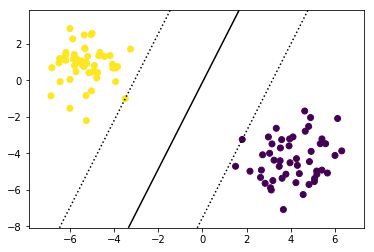
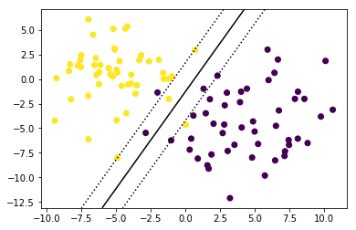
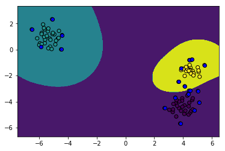

# Support Vector Machines Lab

## 1. First thing's first: generate a data set in scikit learn

Support Vector Machines can be used on problem cases where we have an $n$-dimensional feature space. For teaching purposes, however, it is very intuitive to use a 2-dimensional feature space so you can see what exactly is going on when using support vector machines.

Scikit-Learn has excellent data sets generator. one of them is `make_blobs`, another one is `make_moons`. Let's generate four data sets which we'll all analyze using support vector machines.

Run the cell below to create  and plot some sample data sets.


```python
from sklearn.datasets import make_blobs
from sklearn.datasets import make_moons
import matplotlib.pyplot as plt
%matplotlib inline  
import numpy as np

plt.figure(figsize=(10, 10))

plt.subplot(221)
plt.title("Two blobs")
X, y = make_blobs(n_features = 2, centers = 2, random_state = 123)
plt.scatter(X[:, 0], X[:, 1], c = y, s=25)

plt.subplot(222)
plt.title("Two blobs with more noise")
X, y = make_blobs(n_samples=100, n_features=2, centers=2, cluster_std=2.8,  random_state = 123)
plt.scatter(X[:, 0], X[:, 1], c = y, s=25)

plt.subplot(223)
plt.title("Three blobs")
X, y = make_blobs(n_samples=100, n_features=2, centers=3, cluster_std=0.5,  random_state = 123)
plt.scatter(X[:, 0], X[:, 1], c = y, s=25)

plt.subplot(224)
plt.title("Two interleaving half circles")
X, y = make_moons(n_samples=100, shuffle = False , noise = 0.3, random_state=123)
plt.scatter(X[:, 0], X[:, 1], c = y, s=25)

plt.show()
```


## 2. Two groups 

### 2.1 Max margin

Let's have a look at our first plot again. We'll start with this data set and fit a simple linear support vector machine on these data. You can use the scikit-learn function `svm.SVC` to do that!


```python
X, y = make_blobs(n_features = 2, centers = 2, random_state = 123)
plt.scatter(X[:, 0], X[:, 1], c = y, s=25)
```


    <matplotlib.collections.PathCollection at 0x1a1b878c88>


In the cell below:

* Import the `svm` module from sklearn
* Create a `svc` object (short for "Support Vector Classifier")
* Fit it to the data we created in the cell above.  


```python
from sklearn import svm

clf = svm.SVC(kernel='linear')
clf.fit(X, y)
```


    SVC(C=1.0, cache_size=200, class_weight=None, coef0=0.0,
      decision_function_shape='ovr', degree=3, gamma='auto', kernel='linear',
      max_iter=-1, probability=False, random_state=None, shrinking=True,
      tol=0.001, verbose=False)


Let's save the first feature (on the horizontal axis) as X1 and the second feature (on the vertical axis) as X2.


```python
X1= X[:,0]
X2= X[:,1]
```

Next, let'x store the minimum and maximum values X1 and X2 operate in. We'll add some slack (1) to the min and max boundaries.


```python
# plot the decision function
X1_min, X1_max = X1.min() - 1, X1.max() + 1
X2_min, X2_max = X2.min() - 1, X2.max() + 1
```

Let's see if what we just did makes sense. Have a look at your plot and verify the result!


```python
print(X1_max)
```

    7.321748977894958


Next, we'll create a grid. You can do this by using the numpy function `linspace`, which creates a numpy array with evenly spaced numbers over a specified interval. The default of numbers is 50 and we don't need that many, so let's specify `num = 10` for now. You'll see that you need to up this number one we get to the classification of more than 2 groups.

In the cell below: 

* Set each of the following coordinate variables using `np.linspace()`.  
    * For x1, pass in the appropriate min and max values, along with the constant, '10'.
    * For x2, pass in the appropriate min and max values, along with the constant, '10'.


```python
x1_coord = np.linspace(X1_min, X1_max, 10)
x2_coord = np.linspace(X2_min, X2_max, 10)
```

Now, run the following cells:


```python
X2_C, X1_C = np.meshgrid(x2_coord, x1_coord)
```


```python
x1x2 = np.c_[X1_C.ravel(), X2_C.ravel()]
```

Let's now get the coordinates of the decision function. Run the cells below.


```python
df = clf.decision_function(x1x2).reshape(X1_C.shape)
```


```python
plt.scatter(X1, X2, c = y)
axes = plt.gca()
axes.contour(X1_C, X2_C, df, colors= "black", levels= [-1, 0, 1], linestyles=[':', '-', ':'])
plt.show()
```





The coordinates of the support vectors can be found in the `support_vectors_`-attribute:


```python
clf.support_vectors_
```


    array([[ 1.80628336, -3.23748621],
           [-3.50355959, -0.99875038]])


Run the cell below to create your plot again, but with highlighted support vectors.


```python
plt.scatter(X1, X2, c = y)
axes = plt.gca()
axes.contour(X1_C, X2_C, df, colors= "black", levels= [-1, 0, 1], linestyles=[':', '-', ':'])
axes.scatter(clf.support_vectors_[:, 0], clf.support_vectors_[:, 1], facecolors='blue') 
plt.show()
```


### 2.2 Soft margin tuning

The previous example was pretty easy. The 2 "clusters" were easily separable by one straight line classifying every single instance correctly. But what if this isn't the case? Let's have a look at the second dataset we had generated:

Run the cell below to recreate and plot our second dataset from above.


```python
X, y = make_blobs(n_samples=100, n_features=2, centers=2, cluster_std=2.8,  random_state = 123)
plt.scatter(X[:, 0], X[:, 1], c=y, s=25)

```


    <matplotlib.collections.PathCollection at 0x1a1bee73c8>


In the cell below, repeat the entire process from above.  We're doing the exact same thing as we did above, but to a different dataset--feel free to copy and paste the code you wrote above.


```python
plt.scatter(X[:, 0], X[:, 1], c=y, s=25)

from sklearn import svm

clf = svm.SVC(kernel='linear')
clf.fit(X, y)

X1= X[:,0]
X2= X[:,1]
X1_min, X1_max = X1.min() - 1, X1.max() + 1
X2_min, X2_max = X2.min() - 1, X2.max() + 1

x1_coord = np.linspace(X1_min, X1_max, 10)
x2_coord = np.linspace(X2_min, X2_max, 10)

X2_C, X1_C = np.meshgrid(x2_coord, x1_coord)

x1x2 = np.c_[X1_C.ravel(), X2_C.ravel()]

df = clf.decision_function(x1x2).reshape(X1_C.shape)

plt.scatter(X1, X2, c = y)
axes = plt.gca()
axes.contour(X1_C, X2_C, df, colors= "black", levels= [-1, 0, 1], linestyles=[':', '-', ':'])
plt.show()
```





As you can see, 3 instances are misclassified (1 yellow, 2 purple). The reason for this is that in scikit learn, the svm module automatically allows for slack variables. If we want to make sure we have as few misclassifications as possible, we should set a bigger value for C, the regularization parameter.

Now, we run the same code again, except with a different value for the `C` parameter passed in at initialization for our `svc` object.  Run the cell below and see how our decision boundaries change.  


```python
X, y = make_blobs(n_samples=100, n_features=2, centers=2, cluster_std=2.8,  random_state = 123)
plt.scatter(X[:, 0], X[:, 1], c=y, s=25)

from sklearn import svm

clf = svm.SVC(kernel='linear', C=1000000) 
clf.fit(X, y)
# Start Reusable Section
X1= X[:,0]
X2= X[:,1]
X1_min, X1_max = X1.min() - 1, X1.max() + 1
X2_min, X2_max = X2.min() - 1, X2.max() + 1

x1_coord = np.linspace(X1_min, X1_max, 10)
x2_coord = np.linspace(X2_min, X2_max, 10)

X2_C, X1_C = np.meshgrid(x2_coord, x1_coord)

x1x2 = np.c_[X1_C.ravel(), X2_C.ravel()]

df = clf.decision_function(x1x2).reshape(X1_C.shape)

plt.scatter(X1, X2, c = y)
axes = plt.gca()
axes.contour(X1_C, X2_C, df, colors= "black", levels= [-1, 0, 1], linestyles=[':', '-', ':'])
plt.show()
# End Resuable Section
```


## 3. More than 2 groups

We'll now repeat the same process as above, but on our 3rd dataset.  This dataset contains classes, turning this from a **_Binary Classification_** to a **_Multiclass Classification_** problem.  

Run the cell below to recreate and plot the 3rd dataset we created at the beginning of this lab.  


```python
X, y = make_blobs(n_samples=100, n_features=2, centers=3, cluster_std=0.5,  random_state = 123)
plt.scatter(X[:, 0], X[:, 1], c=y, s=25)
```


    <matplotlib.collections.PathCollection at 0x1a1c01d940>


Now, we'll repeat the same process as we did above.  In the cell below:
* Create a `SVC` object.  Set the `kernel` to `"linear"`, and `C` to `20`.
* `fit` the model to to `X` and `y`. 


```python
clf = svm.SVC(kernel = "linear",C=20) 
clf.fit(X, y)
```


    SVC(C=20, cache_size=200, class_weight=None, coef0=0.0,
      decision_function_shape='ovr', degree=3, gamma='auto', kernel='linear',
      max_iter=-1, probability=False, random_state=None, shrinking=True,
      tol=0.001, verbose=False)


Now, run the cell below to plot the decision boundaries for our multiclass dataset.  


```python
X1= X[:,0]
X2= X[:,1]
X1_min, X1_max = X1.min() - 1, X1.max() + 1
X2_min, X2_max = X2.min() - 1, X2.max() + 1

x1_coord = np.linspace(X1_min, X1_max, 200)
x2_coord = np.linspace(X2_min, X2_max, 200)

X2_C, X1_C = np.meshgrid(x2_coord, x1_coord)

x1x2 = np.c_[X1_C.ravel(), X2_C.ravel()]

Z = clf.predict(x1x2).reshape(X1_C.shape)

axes = plt.gca()
axes.contourf(X1_C, X2_C, Z, alpha = 1)
plt.scatter(X1, X2, c = y, edgecolors = 'k')
axes.scatter(clf.support_vectors_[:, 0], clf.support_vectors_[:, 1], facecolors='blue', edgecolors= 'k') 
plt.show()
```


## 4. The kernel trick

It would probably be nicer to have non-linear decision boundaries here, let's have a look at that! You can also see how your support vectors are changing. 

Run the cell below.  Notice that the only substantial change is to the `kernel` parameter--here, we have changed it from `linear` to `rbf` (for "Radial Basis Function").


```python
X, y = make_blobs(n_samples=100, n_features=2, centers=3, cluster_std=0.5,  random_state = 123)

clf = svm.SVC(kernel='rbf', C=20) 
clf.fit(X, y)

X1= X[:,0]
X2= X[:,1]
X1_min, X1_max = X1.min() - 1, X1.max() + 1
X2_min, X2_max = X2.min() - 1, X2.max() + 1

x1_coord = np.linspace(X1_min, X1_max, 500)
x2_coord = np.linspace(X2_min, X2_max, 500)

X2_C, X1_C = np.meshgrid(x2_coord, x1_coord)

x1x2 = np.c_[X1_C.ravel(), X2_C.ravel()]

Z = clf.predict(x1x2).reshape(X1_C.shape)

axes = plt.gca()
axes.contourf(X1_C, X2_C, Z, alpha = 1)
plt.scatter(X1, X2, c = y, edgecolors = 'k')
axes.scatter(clf.support_vectors_[:, 0], clf.support_vectors_[:, 1], facecolors='blue', edgecolors= 'k') 
plt.show()
```





Let's see one more example of using the kernel trick to find non-linear decision boundaries.  Run the cell below to create another sample dataset, fit an SVM using a non-linear kernel, and plot the decision boundaries.  

As we did in previous examples, we have highlighted our support vectors in blue. 


```python
X, y = make_moons(n_samples=100, shuffle = False , noise = 0.3, random_state=123)

clf = svm.SVC(kernel='rbf', C=20) 
clf.fit(X, y)

X1= X[:,0]
X2= X[:,1]
X1_min, X1_max = X1.min() - 1, X1.max() + 1
X2_min, X2_max = X2.min() - 1, X2.max() + 1

x1_coord = np.linspace(X1_min, X1_max, 500)
x2_coord = np.linspace(X2_min, X2_max, 500)

X2_C, X1_C = np.meshgrid(x2_coord, x1_coord)

x1x2 = np.c_[X1_C.ravel(), X2_C.ravel()]

Z = clf.predict(x1x2).reshape(X1_C.shape)

axes = plt.gca()
axes.contourf(X1_C, X2_C, Z, alpha = 1)
plt.scatter(X1, X2, c = y, edgecolors = 'k')
axes.scatter(clf.support_vectors_[:, 0], clf.support_vectors_[:, 1], facecolors='blue', edgecolors= 'k') 
plt.show()
```


# Sources

https://machinelearningmastery.com/generate-test-datasets-python-scikit-learn/

http://scikit-learn.org/stable/auto_examples/svm/plot_separating_hyperplane.html

https://jakevdp.github.io/PythonDataScienceHandbook/05.07-support-vector-machines.html

http://scikit-learn.org/stable/auto_examples/svm/plot_iris.html
